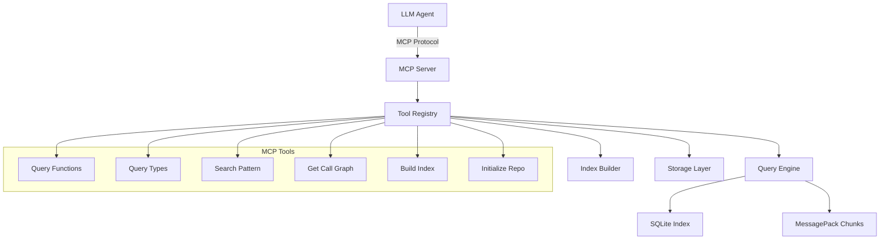

# MCP Server Implementation Plan

## Overview

This document outlines the comprehensive implementation plan for integrating Model Context Protocol (MCP) server functionality into the Repository Context Protocol tool using the [mark3labs/mcp-go](https://pkg.go.dev/github.com/mark3labs/mcp-go/mcp) library.

## Objectives

1. **Expose Repository Analysis as MCP Tools** - Make repocontext functionality available to LLM agents via MCP
2. **Seamless Integration** - Integrate with existing query engine without disrupting CLI functionality
3. **Rich Tool Interface** - Provide comprehensive code analysis tools for AI agents
4. **Performance & Reliability** - Ensure robust, performant MCP server implementation

## Architecture Overview



## Implementation Phases

### Phase 1: Foundation & Core Tools (Week 1-2)

#### 1.1 Dependency Setup
- Add MCP Go library to `go.mod`
- Create MCP server package structure
- Set up basic JSON-RPC handling

#### 1.2 Core MCP Server Structure

**File: `cmd/mcp/main.go`**
```go
package main

import (
    "context"
    "log"
    "os"

    "github.com/mark3labs/mcp-go/mcp"
    "repository-context-protocol/internal/mcp"
)

func main() {
    server := mcpserver.NewRepoContextMCPServer()

    if err := server.Run(context.Background()); err != nil {
        log.Fatalf("MCP server failed: %v", err)
        os.Exit(1)
    }
}
```

**File: `internal/mcp/server.go`**
```go
package mcp

import (
    "context"
    "encoding/json"
    "fmt"
    "io"
    "os"

    "github.com/mark3labs/mcp-go/mcp"
    "repository-context-protocol/internal/index"
)

type RepoContextMCPServer struct {
    server      *mcp.Server
    queryEngine *index.QueryEngine
    storage     *index.HybridStorage
    repoPath    string
}

func NewRepoContextMCPServer() *RepoContextMCPServer {
    // Implementation details
}
```

#### 1.3 Basic Tool Registration

**Core Tools to Implement:**
1. `query_by_name` - Search for functions/types by name
2. `query_by_pattern` - Pattern-based searching
3. `get_call_graph` - Retrieve function call relationships
4. `list_functions` - List all functions in repository
5. `list_types` - List all types in repository

### Phase 2: Advanced Query Tools (Week 3)

#### 2.1 Advanced Search Tools

**File: `internal/mcp/tools.go`**

```go
package mcp

import (
    "context"

    "github.com/mark3labs/mcp-go/mcp"
)

// Tool definitions using mcp-go library
func (s *RepoContextMCPServer) registerQueryTools() {
    // Query by name tool
    queryByNameTool := mcp.NewTool("query_by_name",
        mcp.WithDescription("Search for functions, types, or variables by exact name"),
        mcp.WithString("name", mcp.Required(), mcp.WithDescription("Name to search for")),
        mcp.WithBoolean("include_callers", mcp.WithDescription("Include functions that call this function")),
        mcp.WithBoolean("include_callees", mcp.WithDescription("Include functions called by this function")),
        mcp.WithNumber("max_tokens", mcp.WithDescription("Maximum tokens for response")),
    )

    s.server.AddTool(queryByNameTool, s.handleQueryByName)

    // Query by pattern tool
    queryByPatternTool := mcp.NewTool("query_by_pattern",
        mcp.WithDescription("Search for entities using glob or regex patterns"),
        mcp.WithString("pattern", mcp.Required(), mcp.WithDescription("Search pattern (supports glob and regex)")),
        mcp.WithString("entity_type", mcp.WithDescription("Filter by entity type: function, type, variable, constant")),
        mcp.WithNumber("max_tokens", mcp.WithDescription("Maximum tokens for response")),
    )

    s.server.AddTool(queryByPatternTool, s.handleQueryByPattern)
}

// Tool handlers
func (s *RepoContextMCPServer) handleQueryByName(ctx context.Context, request mcp.CallToolRequest) (*mcp.CallToolResult, error) {
    name := request.RequireString("name")
    includeCallers := request.GetBool("include_callers", false)
    includeCallees := request.GetBool("include_callees", false)
    maxTokens := request.GetInt("max_tokens", 2000)

    // Implementation using existing query engine
    options := index.QueryOptions{
        IncludeCallers: includeCallers,
        IncludeCallees: includeCallees,
        MaxTokens:      maxTokens,
        Format:         "json",
    }

    result, err := s.queryEngine.SearchByNameWithOptions(name, options)
    if err != nil {
        return mcp.NewToolResultError(fmt.Sprintf("Query failed: %v", err)), nil
    }

    // Format result for MCP response
    resultJSON, _ := json.MarshalIndent(result, "", "  ")
    return mcp.NewToolResultText(string(resultJSON)), nil
}
```

#### 2.2 Repository Management Tools

```go
// Repository initialization and building tools
func (s *RepoContextMCPServer) registerRepoTools() {
    // Initialize repository tool
    initTool := mcp.NewTool("initialize_repository",
        mcp.WithDescription("Initialize a repository for semantic indexing"),
        mcp.WithString("path", mcp.WithDescription("Repository path (default: current directory)")),
    )
    s.server.AddTool(initTool, s.handleInitializeRepository)

    // Build index tool
    buildTool := mcp.NewTool("build_index",
        mcp.WithDescription("Build semantic index for the repository"),
        mcp.WithString("path", mcp.WithDescription("Repository path (default: current directory)")),
        mcp.WithBoolean("verbose", mcp.WithDescription("Enable verbose output")),
    )
    s.server.AddTool(buildTool, s.handleBuildIndex)

    // Get repository status tool
    statusTool := mcp.NewTool("get_repository_status",
        mcp.WithDescription("Get current repository indexing status and statistics"),
        mcp.WithString("path", mcp.WithDescription("Repository path (default: current directory)")),
    )
    s.server.AddTool(statusTool, s.handleGetRepositoryStatus)
}
```

### Phase 3: Enhanced Analysis Tools (Week 4)

#### 3.1 Call Graph Analysis Tools

```go
func (s *RepoContextMCPServer) registerCallGraphTools() {
    // Get function call graph
    callGraphTool := mcp.NewTool("get_call_graph",
        mcp.WithDescription("Get detailed call graph for a function"),
        mcp.WithString("function_name", mcp.Required(), mcp.WithDescription("Function name to analyze")),
        mcp.WithNumber("max_depth", mcp.WithDescription("Maximum traversal depth (default: 2)")),
        mcp.WithBoolean("include_external", mcp.WithDescription("Include external function calls")),
    )
    s.server.AddTool(callGraphTool, s.handleGetCallGraph)

    // Find function dependencies
    dependenciesTool := mcp.NewTool("find_dependencies",
        mcp.WithDescription("Find all dependencies for a given function or type"),
        mcp.WithString("entity_name", mcp.Required(), mcp.WithDescription("Entity name to analyze")),
        mcp.WithString("dependency_type", mcp.WithDescription("Type of dependencies: callers, callees, or both")),
    )
    s.server.AddTool(dependenciesTool, s.handleFindDependencies)
}
```

#### 3.2 Code Context Tools

```go
func (s *RepoContextMCPServer) registerContextTools() {
    // Get function context
    functionContextTool := mcp.NewTool("get_function_context",
        mcp.WithDescription("Get complete context for a function including signature, calls, and related types"),
        mcp.WithString("function_name", mcp.Required(), mcp.WithDescription("Function name")),
        mcp.WithBoolean("include_implementations", mcp.WithDescription("Include function implementation details")),
        mcp.WithNumber("context_lines", mcp.WithDescription("Number of context lines around function")),
    )
    s.server.AddTool(functionContextTool, s.handleGetFunctionContext)

    // Get type context
    typeContextTool := mcp.NewTool("get_type_context",
        mcp.WithDescription("Get complete context for a type including methods, fields, and usage"),
        mcp.WithString("type_name", mcp.Required(), mcp.WithDescription("Type name")),
        mcp.WithBoolean("include_methods", mcp.WithDescription("Include all methods for the type")),
        mcp.WithBoolean("include_usage", mcp.WithDescription("Include usage examples")),
    )
    s.server.AddTool(typeContextTool, s.handleGetTypeContext)
}
```

### Phase 4: Integration & Testing (Week 5)

#### 4.1 Server Lifecycle Management

**File: `internal/mcp/server.go` (Extended)**

```go
func (s *RepoContextMCPServer) Run(ctx context.Context) error {
    // Initialize server capabilities
    capabilities := mcp.ClientCapabilities{
        // Configure supported capabilities
    }

    // Set up server with proper initialization
    s.server = mcp.NewServer(mcp.ServerOptions{
        Name:    "repocontext",
        Version: "1.0.0",
    })

    // Register all tool categories
    s.registerQueryTools()
    s.registerRepoTools()
    s.registerCallGraphTools()
    s.registerContextTools()

    // Initialize repository context if available
    if err := s.initializeQueryEngine(); err != nil {
        return fmt.Errorf("failed to initialize query engine: %w", err)
    }

    // Start JSON-RPC server (stdin/stdout)
    return s.server.Serve(ctx, os.Stdin, os.Stdout)
}

func (s *RepoContextMCPServer) initializeQueryEngine() error {
    // Detect repository root
    repoPath, err := s.detectRepositoryRoot()
    if err != nil {
        return err
    }

    s.repoPath = repoPath

    // Initialize storage
    storage := index.NewHybridStorage(filepath.Join(repoPath, ".repocontext"))
    if err := storage.Initialize(); err != nil {
        return fmt.Errorf("failed to initialize storage: %w", err)
    }

    s.storage = storage
    s.queryEngine = index.NewQueryEngine(storage)

    return nil
}
```

#### 4.2 Error Handling & Response Formatting

```go
// Helper functions for MCP responses
func (s *RepoContextMCPServer) formatSuccessResponse(data interface{}) *mcp.CallToolResult {
    jsonData, err := json.MarshalIndent(data, "", "  ")
    if err != nil {
        return mcp.NewToolResultError(fmt.Sprintf("Failed to format response: %v", err))
    }
    return mcp.NewToolResultText(string(jsonData))
}

func (s *RepoContextMCPServer) formatErrorResponse(operation string, err error) *mcp.CallToolResult {
    errorMsg := fmt.Sprintf("Operation '%s' failed: %v", operation, err)
    return mcp.NewToolResultError(errorMsg)
}

func (s *RepoContextMCPServer) validateRepository() error {
    if s.repoPath == "" {
        return fmt.Errorf("no repository initialized")
    }

    repoContextPath := filepath.Join(s.repoPath, ".repocontext")
    if _, err := os.Stat(repoContextPath); os.IsNotExist(err) {
        return fmt.Errorf("repository not initialized - run initialize_repository first")
    }

    return nil
}
```

## Tool Specifications

### Core Query Tools

#### 1. `query_by_name`
**Purpose:** Search for functions, types, or variables by exact name
**Parameters:**
- `name` (required): Name to search for
- `include_callers` (optional): Include calling functions
- `include_callees` (optional): Include called functions
- `include_types` (optional): Include related types
- `max_tokens` (optional): Token limit for response

**Response:** JSON object with search results, call graph data, and metadata

#### 2. `query_by_pattern`
**Purpose:** Pattern-based searching with glob/regex support
**Parameters:**
- `pattern` (required): Search pattern
- `entity_type` (optional): Filter by type (function, type, variable, constant)
- `max_tokens` (optional): Token limit for response

**Response:** JSON array of matching entities with metadata

#### 3. `get_call_graph`
**Purpose:** Get detailed call graph for a function
**Parameters:**
- `function_name` (required): Function to analyze
- `max_depth` (optional): Traversal depth (default: 2)
- `include_external` (optional): Include external calls

**Response:** Call graph with callers, callees, and relationship metadata

### Repository Management Tools

#### 4. `initialize_repository`
**Purpose:** Initialize repository for semantic indexing
**Parameters:**
- `path` (optional): Repository path (default: current directory)

**Response:** Success/failure status with initialization details

#### 5. `build_index`
**Purpose:** Build semantic index for repository
**Parameters:**
- `path` (optional): Repository path
- `verbose` (optional): Enable verbose output

**Response:** Build statistics and status information

#### 6. `get_repository_status`
**Purpose:** Get current repository status and statistics
**Parameters:**
- `path` (optional): Repository path

**Response:** Repository status, index statistics, and metadata

## Testing Strategy

### Unit Tests
- Tool registration and configuration
- Request parameter parsing and validation
- Response formatting and error handling
- Query engine integration

### Integration Tests
- End-to-end MCP protocol communication
- Tool execution with real repository data
- Error scenarios and edge cases
- Performance testing with large repositories

### Test Structure
```bash
internal/mcp/
├── server_test.go
├── tools_test.go
├── integration_test.go
└── testdata/
├── sample_requests.json
└── expected_responses.json
```

## Deployment Configuration

### Build Integration
Update `Makefile`:
```makefile
MCP_BINARY_NAME=repocontext-mcp

build: build-cli build-mcp

build-mcp:
	go build -o bin/$(MCP_BINARY_NAME) cmd/mcp/main.go

install: build
	cp bin/$(BINARY_NAME) /usr/local/bin/
	cp bin/$(MCP_BINARY_NAME) /usr/local/bin/
```

### MCP Server Configuration
Create configuration for LLM clients:
```json
{
  "name": "repocontext",
  "description": "Repository Context Protocol MCP Server",
  "command": "repocontext-mcp",
  "args": [],
  "env": {}
}
```

## Performance Considerations

### Memory Management
- Lazy loading of semantic chunks
- Query result caching for repeated requests
- Memory-efficient JSON streaming for large responses

### Response Optimization
- Token-aware response truncation
- Incremental loading for large call graphs
- Compressed responses for network efficiency

### Concurrency
- Thread-safe query engine access
- Connection pooling for multiple clients
- Graceful handling of concurrent requests

## Security Considerations

### Input Validation
- Parameter sanitization and validation
- Path traversal prevention
- Query injection protection

### Access Control
- Repository access validation
- File system permission checking
- Rate limiting for resource-intensive operations

## Success Metrics

### Functionality
- All core tools operational and tested
- Seamless integration with existing query engine
- Comprehensive error handling and validation

### Performance
- Query response time < 200ms for typical operations
- Memory usage < 100MB for standard repositories
- Support for repositories with 10k+ files

### Reliability
- Zero crashes during normal operation
- Graceful degradation for edge cases
- Comprehensive logging and monitoring

## Future Enhancements

### Advanced Features
- Real-time index updates via file watching
- Incremental indexing for large repositories
- Cross-language analysis and relationships

### Protocol Extensions
- Custom MCP resources for documentation
- Streaming responses for large datasets
- Subscription-based change notifications

### Integration Improvements
- Language Server Protocol bridge
- IDE plugin integration
- CI/CD pipeline integration

## Implementation Timeline

| Phase | Duration | Deliverables |
|-------|----------|-------------|
| Phase 1 | Week 1-2 | Core MCP server, basic tools |
| Phase 2 | Week 3 | Advanced query tools, repo management |
| Phase 3 | Week 4 | Call graph tools, context analysis |
| Phase 4 | Week 5 | Integration, testing, documentation |

Total estimated time: **5 weeks**

This implementation plan provides a solid foundation for exposing the Repository Context Protocol's powerful code analysis capabilities to LLM agents via the Model Context Protocol, enabling rich AI-powered code understanding and manipulation workflows.
